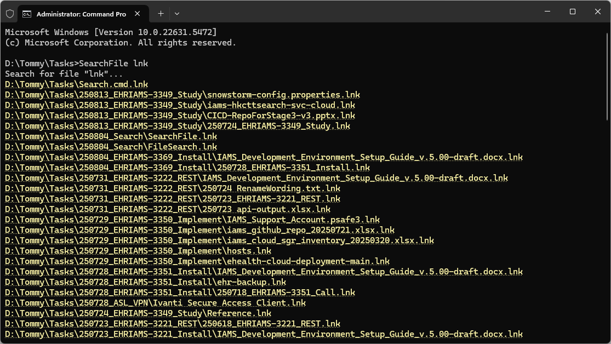

# Search File

This is a simple tool to search files in breadth-first order.



## Skip Pattern

Put a _config.json_ next to _SearchFile.exe_ and skip by pattern

```json
{
  "skip": ["\\\\.git$", "\\\\.svn$", "\\\\bin$", "\\\\obj$", "\\\\target$"]
}
```

## Add to PATH

I suggest adding to _PATH_ so that you can search with `SearchFile` directly.

## File Search

If you would like to search file content, checkout the sibling project

https://github.com/tommy-iasia/FileSearch 💛
